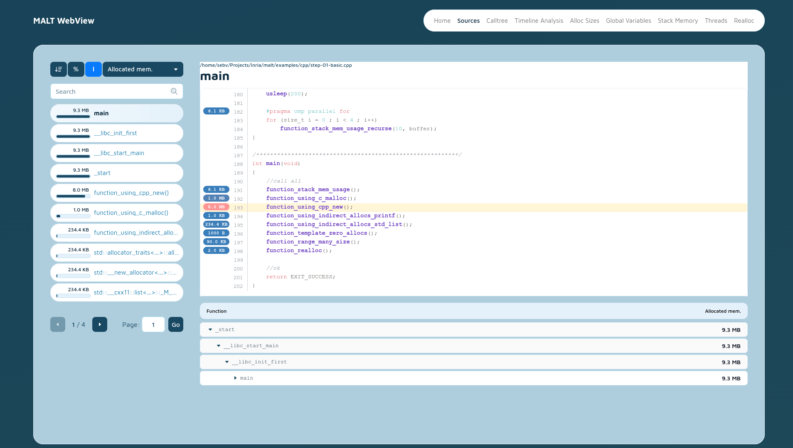

MALT : Malloc Tracker
=====================

What is it
----------

MALT is a memory tool to find where you allocate your memory. It also provides you some
statistics about memory usage and help to find memory leaks.

It is done to be used on laguages : **C**, **C++**, **Fortran**, **Rust** and **Python**.



Documentation
-------------

You will find all the details about using **MALT** into the Your will find the dependences into the [official documentation](http://memtt.github.io/malt/doc/latest/).

Dependences
-----------

Your will find the dependences into the [official documentation](http://memtt.github.io/malt/doc/latest/start/dependencies.html).

How to install
--------------

MALT use CMake for the build system but provide a simple configure wrapper for users
familiar with autotools packaging so you can install by following the procedure :

```shell
mkdir build
cd build
../configure --prefix={YOUR_PREFIX}
make
make test
make install
```

Your will find the dependences into the [official documentation](http://memtt.github.io/malt/doc/latest/).

How to use
----------

MALT currently provides a dynamic library you need to preload in your application to
wrap the default memory allocator. It provides two basic instrumentation modes.

By default MALT use backtrace to reconstruct you stack on malloc/free/... calls :

```shell
malt {YOUR_PROGRAM} [OPTIONS]
```

Your will find the dependences into the [official documentation](http://memtt.github.io/malt/doc/latest/).

Using webview
-------------

You can use the webview by calling command `malt-webview` as :

```shell
malt-webview [-p PORT] [--no-auth] malt-YOUR_PROGRAM-1234.json
```

Profiling python
----------------

**Note:** This is currently **fresh released**, there are for sure still some issues.

First you need to build MALT by enabling python support : you will need to have
the python headers (package `python3-dev or libpython3-dev or python3-devel`) on your plateform.

In practice MALT after being built will be able to run over various versions of python without beeing
rebuilt as long as they follow the standard API which is currently stable. It should also work on the
python delivered by [Anaconda](https://www.anaconda.com/).

Supported version are currently python from **version 11**.

Due to large number of memory allocations in python MALT currently have a large overhead over python.
There is in consequence several way to instrument your app which I sort in overhead increasing order.

```bash
# Use default mode (python-only)
malt-python ./script.py
# profile without stacks
malt-python --profile python-no-stack ./script.py
# Get C and Python stack as two distinct domains (not mixed)
malt-python --profile python-domains ./script.py
# An approximativ method by sampling instead of tracking each stack (faster but not exact)
malt-python --profile python-sampling ./script.py
# Similar but with less samples
malt-python --profile python-sampling-10M ./script.py
# Similar but with less and less samples
malt-python --profile python-sampling-20M ./script.py
# profile considering only python stacks (C is mapped under python)
malt-python --profile python-only ./script.py
# Full instrumentation of Python + C
malt-python --profile python-full ./script.py
```

**Note**: The `malt-python` is just a wrapper over `malt` command profiding a different default
profile sepcific for python, you can also use directly the `malt` command.

**Note**: The `malt-python` command is a temporary workaround, it might disapear in future.

Similar tools
-------------

If you search similar tools all over the web you might find:

- Heaptrack: A Heap Memory Profiler for Linux: KDE/heaptrack: <https://github.com/KDE/heaptrack>
- Memoro: A detailed Heap Profiler : <https://epfl-vlsc.github.io/memoro/>
- Memtrail: <https://github.com/jrfonseca/memtrail>
- MTuner: <https://milostosic.github.io/MTuner/>
- Profiler provided with google allocator: [Google Heap Profiler](https://code.google.com/p/gperftools/wiki/GooglePerformanceTools)
- [Valgrind memcheck](http://valgrind.org/)
- Valgrind massif: [Valgrind massif](http://valgrind.org/) with [Massif visualizer](https://projects.kde.org/projects/extragear/sdk/massif-visualizer)
- [Dr. Memory](http://www.drmemory.org/)
- Commercial tool, [Parasoft Insure++](https://www.parasoft.com/product/insure/)
- Commercial tool, [Unicom PurifyPlus](http://unicomsi.com/products/purifyplus/) (previously IBM)
- [Tau](https://www.cs.uoregon.edu/research/tau/home.php) is more a communication profiling tool for HPC apps, but it offers a [memory module](https://www.cs.uoregon.edu/research/tau/docs/old/bk05ch04.html)
- Similar approach than MALT for the backend: [IgProf](http://igprof.org/)
- A debug malloc library: [Dmalloc](http://dmalloc.com/)
- Profiling and leak detection: [MemProf](http://people.redhat.com/otaylor/memprof/)
- [Malloc count](http://panthema.net/2013/malloc_count/)
- [mpatrol](http://mpatrol.sourceforge.net/)
- Tracing tool for parallel programs: [EZTrace](http://eztrace.gforge.inria.fr/)
- Find Obsolete Memory: [FOM Tools](https://gitlab.cern.ch/fom/FOM-tools/wikis/home)
- Memray: A memory profiler support python. <https://bloomberg.github.io/memray/>
- Scalene: A perf and memory profiler for C & python : <https://pypi.org/project/scalene/>

If ever I missed new ones, you can also look on the repos of this person keeping an up-to-date list:
<https://github.com/MattPD/cpplinks/blob/master/performance.tools.md>

Parallel allocators
-------------------

If you search some parallel memory allocators, you can find those one on the net:

- [Jemalloc (facebook, firefox)](http://www.canonware.com/jemalloc/)
- [TCMalloc (google)](https://github.com/gperftools/gperftools)
- [Hoard](http://www.hoard.org/)
- [Lockless allocator](http://locklessinc.com/downloads/)
- [MPC](https://github.com/cea-hpc/mpc-allocator) memory allocator from Multi-Processor Computing framework.
- [mimalloc](https://github.com/microsoft/mimalloc)

License
-------

MALT is distributed under CeCILL-C license (LGPL compatible).

To cite
-------

If you publish about MALT, you cite this research paper as reference :

```
Sébastien Valat, Andres S. Charif-Rubial, and William Jalby. 2017. MALT: a Malloc tracker.
In Proceedings of the 4th ACM SIGPLAN International Workshop on Software Engineering for
Parallel Systems (SEPS 2017). Association for Computing Machinery, New York, NY, USA,
1–10. https://doi.org/10.1145/3141865.3141867
```

Discussion
----------

If you have questions of remarks, you can also send me a mail at **memtt@progranet.ovh**.
